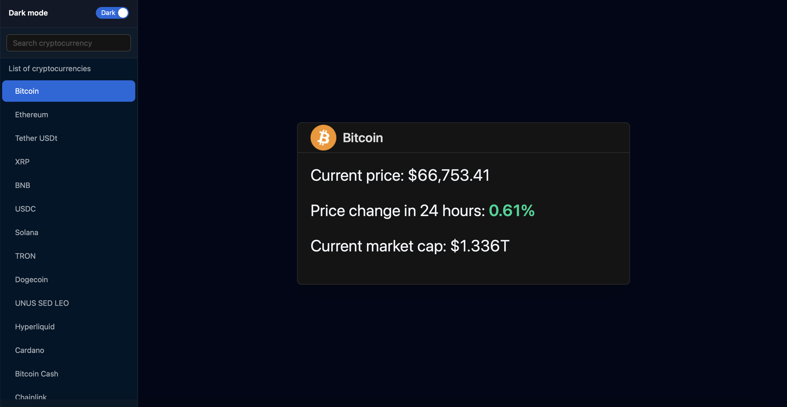

# CMC

**CMC** stands for **Crypto Market Companion** and uses the **CoinMarketCap API** to display cryptocurrency data.

A small full-stack cryptocurrency viewer built with **FastAPI** on the backend and **React + Vite + Tailwind CSS + Ant Design** on the frontend.

The application loads cryptocurrency data from the **CoinMarketCap API** and displays selected currency details in a card view.


## Preview



Dark mode dashboard with cryptocurrency list, theme switcher, and detailed currency card.

## Features

- View a list of cryptocurrencies in the sidebar
- Click a currency to see detailed information
- Backend built with FastAPI
- Frontend built with React, Vite, Tailwind CSS, and Ant Design
- Run the full project with a single command

---

## Project Structure

```text
CMC/
├── backend/
│   ├── requirements.txt
│   └── src/
│       ├── config.py
│       ├── http_client.py
│       ├── init.py
│       ├── main.py
│       └── router.py
├── frontend/
│   ├── src/
│   ├── package.json
│   ├── vite.config.js
│   └── ...
├── .env.example
├── .gitignore
├── package.json
└── README.md
```

---

## Requirements

Before running the project, make sure you have installed:

- **Python 3.10 or newer**
- **Node.js**
- **npm**

Check installed versions:

```bash
python3 --version
node -v
npm -v
```

---

## 1. Clone the Project

```bash
git clone <your-repository-url>
cd CMC
```

---

## 2. Create a Python Virtual Environment

Create and activate a virtual environment.

### macOS / Linux

```bash
python3 -m venv venv310
source venv310/bin/activate
```

### Windows PowerShell

```powershell
python -m venv venv310
venv310\Scripts\Activate.ps1
```

---

## 3. Install Backend Dependencies

With the virtual environment activated, run:

```bash
pip install -r backend/requirements.txt
```

---

## 4. Install Frontend Dependencies

From the project root, run:

```bash
cd frontend
npm install
cd ..
```

---

## 5. Get a CoinMarketCap API Key

To run this project, you need a **CoinMarketCap API key**.

You can register and get a **free API key** here:

`https://coinmarketcap.com/api/`

After registration, create a file named `.env` inside the `backend` folder:

```text
backend/.env
```

Add your API key like this:

```env
CMC_API_KEY=your_real_coinmarketcap_api_key_here
```

A template file is already included in the project:

```text
.env.example
```

---

## 6. Run the Project

From the **project root**, run:

```bash
npm install
npm run dev
```

This starts both services:

- **Backend:** `http://127.0.0.1:8000`
- **Frontend:** `http://localhost:5173`

---

## 7. Open the Application

Open the frontend in your browser:

```text
http://localhost:5173
```

Optional backend checks:

```text
http://127.0.0.1:8000/
http://127.0.0.1:8000/docs
```

- `/` returns a simple API status message
- `/docs` opens FastAPI Swagger UI

---

## How It Works

- The frontend sends requests through the Vite proxy using `/api/...`
- Vite forwards these requests to the FastAPI backend
- The backend requests cryptocurrency data from the CoinMarketCap API
- The frontend displays the selected cryptocurrency in a card component

---

## Tech Stack

### Frontend

- React
- Vite
- Tailwind CSS
- Ant Design
- Axios

### Backend

- FastAPI
- Uvicorn
- aiohttp
- async-lru
- pydantic-settings
- python-dotenv

---

## Troubleshooting

### `npm run dev` does not start

Make sure you are in the project root and that the root `package.json` file exists.

### Backend does not start

Make sure:

- your virtual environment is activated
- backend dependencies are installed
- your `.env` file exists inside `backend`

### Frontend opens but no data is shown

Check that:

- the backend is running
- `backend/.env` exists
- `CMC_API_KEY` is valid

### Port is already in use

Stop the process currently using the port or change the port settings.

### Tailwind styles do not work

Make sure frontend dependencies are installed and restart the Vite development server.

---

## Security Note

Do **not** commit your real `.env` file to GitHub.

Your real API key must stay only in:

```text
backend/.env
```

The `.env.example` file should contain only a placeholder value.